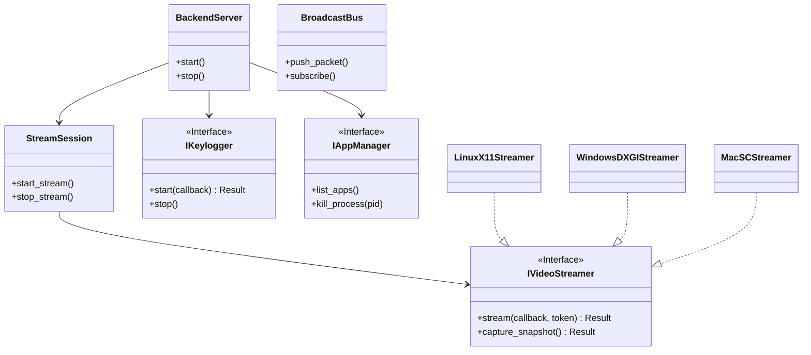

# CafeInternetManager - Universal Agent Master Design
**Version:** 3.0.0 (Interface-Centric Production Standard)
**Date:** December 2025
**Status:** **READY FOR EXECUTION**

---

## 1. Executive Vision: The "Interface-First" Paradigm
The primary objective of this refactor is **Decoupling**. We are transforming a monolithic, OS-dependent codebase into a modular, production-grade system driven by strict Interfaces.

**The Golden Rule:**
> "High-level modules (Backend Core) should not depend on low-level modules (Linux/Windows Implementations). Both should depend on Abstractions (Interfaces)."

This ensures that our Business Logic (Networking, Protocol, Congestion Control) is written **ONCE** and runs **EVERYWHERE**, while OS-specific details are hidden behind stable API boundaries.

---

## 2. High-Level Architecture (The Big Picture)

### 2.1 System Context Diagram
This diagram illustrates how the encapsulated Core communicates with the outside world strictly through Interfaces.



### 2.2 The Dependency Rule
*   **Allowed:** `src/core` depends on `include/interfaces`.
*   **Allowed:** `src/platform/linux` depends on `include/interfaces`.
*   **FORBIDDEN:** `src/core` depends on `src/platform/linux`. (Compilation Error).

---

## 3. Detailed Interface Specifications
These interfaces are the "Products" of this phase. They must be stable, minimal, and sufficient.

### 3.1 `IVideoStreamer` (The Eyes)
Abstraction of screen capture and H.264 encoding.

```cpp
namespace interfaces {
    class IVideoStreamer {
    public:
        virtual ~IVideoStreamer() = default;

        // Core Stream Contract:
        // 1. Blocking Call: Runs until token cancelled or error.
        // 2. Non-Blocking Callback: 'sink' must return quickly.
        // 3. Metadata: Packets must contain valid PTS and Generation ID.
        virtual Result<Ok> stream(
            std::function<void(const common::VideoPacket&)> sink,
            common::CancellationToken token
        ) = 0;

        // Snapshot Contract:
        // Returns a single raw frame (JPEG or RGB).
        virtual Result<common::RawFrame> capture_snapshot() = 0;
    };
}
```

### 3.2 `IKeylogger` (The Ears)
Abstraction of input interception.

```cpp
namespace interfaces {
    struct KeyEvent {
        uint32_t key_code;
        bool is_press;
        uint64_t timestamp;
    };

    class IKeylogger {
    public:
        virtual ~IKeylogger() = default;

        // Async Start Contract:
        // Starts a background thread/hook. Returns immediately.
        virtual Result<Ok> start(std::function<void(const KeyEvent&)> on_key) = 0;

        // Stop Contract:
        // Detaches hooks/threads safely.
        virtual void stop() = 0;
    };
}
```

### 3.3 `IAppManager` (The Hands)
Abstraction of process control.

```cpp
namespace interfaces {
    struct AppEntry { std::string name; uint32_t pid; std::string icon; };

    class IAppManager {
    public:
        virtual ~IAppManager() = default;
        virtual std::vector<AppEntry> list_applications() = 0;
        virtual Result<uint32_t> launch_app(const std::string& command) = 0;
        virtual Result<Ok> kill_process(uint32_t pid) = 0;
    };
}
```

---

## 4. Production Transition Plan (The Roadmap)

How do we move from the current code to this architecture?

### Phase 1: The "Contract" Definition (Day 1-2)
**Goal:** Establish the Interface Headers and Common Types.
1.  Create `include/common/` (Result, Types, Cancellation).
2.  Create `include/interfaces/` (IVideoStreamer, IKeylogger).
3.  **Deliverable:** A compilable set of headers defining the system boundaries.

### Phase 2: Core Skeleton (Day 3-5)
**Goal:** Build the Core logic that uses *only* the interfaces.
1.  Implement `BroadcastBus` (The logic engine).
2.  Implement `StreamSession` (The state machine).
3.  Refactor `BackendServer` to accept `std::shared_ptr<IVideoStreamer>` via constructor.
4.  **Verification:** Write a `MockStreamer` (generates fake red frames) and run the Server. If streaming works (network-wise), the Core is solid.

### Phase 3: The "Adapter" Pattern (Day 6-8)
**Goal:** Wrap the existing legacy code into the new Interfaces.
1.  Create `src/platform/linux/LinuxX11Streamer.cpp`.
    *   Move code from `monitor.cpp`.
    *   Adapt `ffmpeg` output to `VideoPacket` struct.
2.  Create `src/platform/linux/LinuxEvdevLogger.cpp`.
    *   Move code from `keylogger.cpp`.
3.  **Deliverable:** The Linux version compiles and runs exactly as before, but internally structured purely on interfaces.

### Phase 4: Composition Root (Day 9)
**Goal:** The Final Wiring.
1.  Update `main.cpp` to perform Dependency Injection.
2.  "If Linux -> Inject LinuxX11Streamer".
3.  "If Windows -> Inject WindowsDXGIStreamer".

---

## 5. Why This is "Production Level"
1.  **Testability:** We can unit test the networking code with `MockStreamer` without needing a physical screen or FFmpeg.
2.  **Stability:** The `Result<T>` contract prevents the "silent crash" issues we faced earlier.
3.  **Scalability:** The `BroadcastBus` logic (Backpressure) guarantees the server won't hang when 50 clients connect.
4.  **Maintainability:** Adding macOS support later involves *adding* files to `src/platform/macos`, not touching a single line of `BackendServer.cpp`.

This is the definitive blueprint for the project's evolution.
